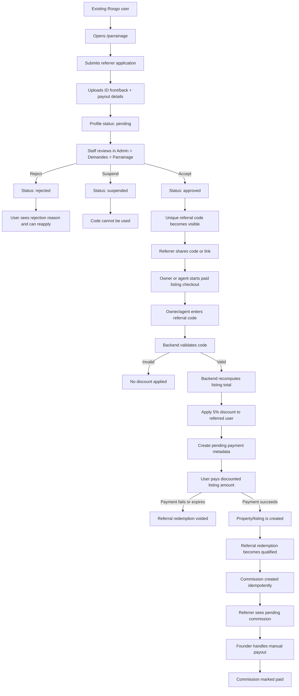

# Roadmap

This document tracks major product features that need durable implementation
context beyond code comments. Each feature should capture the product intent,
business rules, data model, rollout notes, and test coverage.

The **Shipped** section below is a high-level, user-benefit view of what
`roogo-web` does today — derived from the live surfaces (`app/`, `app/api/`,
`components/`, `vercel.json` crons). It also serves as the **sole backend for the
mobile app**, so much of this powers `roogo` too; the mobile-side benefit view
lives in [`roogo/docs/roadmap.md`](../../roogo/docs/roadmap.md). Forward-looking
work continues in the **Feature Checklist** and detailed sections that follow.

---

## Recently completed

- [x] **Sale details use sale pricing semantics** — verified on 2026-08-29
  across staff, owner, and public detail surfaces; see the
  [changelog](./CHANGELOG.md#2026-08-29).
- [x] **Admin rental/sale filtering restored** — verified and merged on
  2026-08-29 in [PR #16](https://github.com/saliftankoano/roogo-web/pull/16).
  See the [changelog](./CHANGELOG.md#2026-08-29).
- [x] **Roogo Mebo host and gated advertiser foundation** — merged on
  2026-08-29 in [PR #15](https://github.com/saliftankoano/roogo-web/pull/15).
  Broad advertiser onboarding remains feature-controlled; see the
  [changelog](./CHANGELOG.md#2026-08-29).
- [x] **Unified, reduced-motion-aware web motion baseline** — merged on
  2026-08-29 in [PR #15](https://github.com/saliftankoano/roogo-web/pull/15),
  including the prebuild motion audit. See the
  [changelog](./CHANGELOG.md#2026-08-29).
- [x] **Staff-assisted ownership dossier workflow** — merged on 2026-08-29 in
  [PR #14](https://github.com/saliftankoano/roogo-web/pull/14). See the
  [changelog](./CHANGELOG.md#2026-08-29).
- [x] **Public Blog and owner tutorial help center** — merged on 2026-08-28 in
  [PR #13](https://github.com/saliftankoano/roogo-web/pull/13). See the
  [changelog](./CHANGELOG.md#2026-08-28).

## Shipped

### For visitors & renters — discover, apply, and rent in the browser

- [x] **Blog and owner tutorials** — public, onboarding-exempt guides explain
      owner signup and sale-listing workflows with video, structured data, and
      contextual links from the relevant product surfaces.

- [x] **Public, shareable marketplace** — browse listings at `/proprietes` and open
      any home at `/p/[id]` or `/proprietes/[id]` without an account. Pages are
      SEO-friendly with sitemap, robots, and OpenGraph share images, so a WhatsApp or
      Facebook link previews properly and pulls in demand.
- [x] **Full property detail** — gallery, amenities, conditions, agent info, and
      open-house availability, mirroring the mobile experience on the web.
- [x] **Save favorites & track views** — persistent favorites and view tracking tie
      the web and app sessions to one account.
- [x] **Apply and book a visit** — submit a rental application and reserve open-house
      slots from the browser.
- [x] **Lock & pay to secure a home** — reserve/lock a property and pay deposit +
      first month via mobile money (Orange, Moov, MTN, Wave, Free in Burkina Faso,
      Côte d'Ivoire, and Senegal) through PawaPay, with hosted payment-page and callback
      handling.
- [x] **International contact numbers** — onboarding and Clerk metadata validation
      accept E.164 phone/WhatsApp from 10 countries (Burkina Faso default plus Belgium,
      Canada, Côte d'Ivoire, France, Italy, Mali, Niger, Senegal, and the United States)
      for diaspora users signing up from abroad.
- [x] **Sign the lease online** — receive, review, sign, or decline a rental agreement
      (bail), with a generated PDF contract.
- [x] **Pay rent and keep receipts** — rent schedules plus downloadable per-transaction
      rent receipts.
- [x] **Protected deposits** — security deposits held with claim, approve-refund,
      evidence upload, and payout-phone flows so renters get their money back fairly.
- [x] **Verify identity once** — submit identity documents for a verified badge that
      builds trust across the marketplace.
- [x] **Earn through referrals** — the `/parrainage` referral / Roogo Pro Agent program
      lets users bring in business and track commissions.
- [x] **Self-serve account & legal** — onboarding, account-deletion requests, contact,
      and full legal pages (privacy FR + EN, terms, sitemap).

### For owners & agents — list, manage, and get paid on a bigger screen

- [x] **Owner/agent dashboard** — manage all listings at `/mes-proprietes` with a
      desktop-grade create/edit listing wizard (location picker, photo uploader with
      client-side HEIC→JPEG compression).
- [x] **Staged owner edits with staff review** — published listings stay live while
      owners propose changes (price, location, description, rules, etc.); staff approve
      or reject at `/admin/modifications` before anything goes live. Mobile uses the same
      backend flow.
- [x] **Run the leasing pipeline** — review incoming applications, manage open-house
      availability, lock a property to a chosen renter, and see the locked renter.
- [x] **Issue and manage leases** — create rental agreements, send them, and track
      sign/decline state.
- [x] **Collect rent and cash out** — owner wallet with payout options and payout
      requests; rent-schedule visibility on the owner side.
- [x] **Handle deposits** — file claims and approve refunds against held deposits.

### For staff & founders — operate the marketplace (`/admin`)

- [x] **Listing moderation** — review and act on annonces before they go live.
- [x] **Composable listing filters** — combine keyword, location, physical
      property type, Residential/Business category, and rental/sale intent.
- [x] **Staff-assisted ownership dossiers** — create or reuse a pending dossier
      for an owner-linked sale and append private evidence without exposing it in
      the listing gallery.
- [x] **Owner edit moderation** — review staged changesets from `/admin/modifications`
      (approve applies diff to `properties`; reject notifies owner with optional note).
- [x] **Applications & locks desk** — manage applications, locks, and spontaneous
      ("spontanées") applications in one place.
- [x] **Dispute resolution** — litiges queue to review and resolve deposit/tenancy
      disputes.
- [x] **Identity verification review** — approve or reject submitted KYC documents.
- [x] **Finances & dynamic pricing** — finances view plus server-side pricing controls
      (tiers, add-ons, commission) editable without an app release.
- [x] **People & growth ops** — users management, referral/parrainage administration,
      talent pipeline, and open-house calendar.
- [x] **Content management** — manage marketing/content surfaces from the panel.
- [x] **Talent & careers** — public `/carrieres` and `/talent` flows with admin review
      of applications and owner–talent matching.

### Platform — the engine behind both apps

- [x] **Single backend for web + mobile** — every authenticated mobile mutation hits
      these `/api/*` routes (Bearer-JWT auth, CORS, rate limiting via Upstash).
- [x] **Host-aware Mebo foundation** — Roogo Mebo has a distinct host shell and
      gated advertiser profile/proof APIs while reusing Roogo identity and
      backend infrastructure.
- [x] **Shared motion baseline** — route, navigation, menu, and feedback motion
      use one reduced-motion-aware system enforced by a prebuild audit.
- [x] **Payments integration** — PawaPay initiate / status-poll / callback webhook for
      multi-country mobile money (8 correspondents across BFA, CIV, SEN); legacy
      `ORANGE_MONEY` / `MOOV_MONEY` requests still map to Burkina Faso for older mobile
      builds.
- [x] **Push notifications** — push-token registration and delivery (e.g. renter rent
      notifications).
- [x] **Analytics & trending** — PostHog product analytics plus a trending endpoint and
      hourly view aggregation.
- [x] **Automated upkeep (cron)** — deposit auto-release, deposit deadline reminders,
      deposit evidence retention, view aggregation, and property-storage cleanup.
- [x] **Identity & auth backbone** — Clerk auth with webhook sync, Supabase user
      mirroring, and a staff-code join flow.
- [x] **French-safe text storage** — user text is stored without HTML encoding so
      accented characters and apostrophes render correctly in push notifications, mobile,
      and PDFs; legacy encoded rows are backfilled via migrations 032–033.

---

## Feature Checklist

Use this list as the quick completion view for major features.

- [x] Staged owner property edits with staff review — shipped; migrations 031–033
      applied in dev; production migration + QA pending
- [x] International phone numbers + multi-country mobile money — shipped (mobile
      `76f7c7b`, web `8ec4cdc`); sandbox QA for CIV/SEN correspondents pending
- [x] Referral / Roogo Pro Agent Pilot - developed; referral UI, admin review,
      checkout pricing, commission creation, and approval-state handling are in
      place; pending database migration and production QA
- [ ] CINET card payments for diaspora renters - enable card payments through
      CINET so users abroad can reserve and rent homes before arriving
- [ ] Daily rental request-to-book flow - launch daily rentals with owner
      approval before payment, renter check-in/checkout confirmations, and
      payout availability after completed checkout; product spec in
      [`daily-rental-request-book-payout-flow.md`](daily-rental-request-book-payout-flow.md)
- [ ] Owner-side rent-received push notification - send a push to the owner
      when their tenant pays rent (today only the renter is notified)

## [x] Staged Owner Property Edits With Staff Review

Status: implemented; pending production migration (031–033) and end-to-end QA

### Goal

After a listing is published, owners and agents need to adjust price, location,
description, house rules, and other fields without staff doing the edit for them.
Every owner change is **staged** in `property_pending_edits` and reviewed by staff
before it replaces live data — the listing stays online with current values until
approval.

This avoids silent misrepresentation (e.g. bait-and-switch pricing) while giving
owners day-to-day control over their annonces.

### Product Rules

- Only the listing owner (`agent_id`) may submit a pending changeset; staff may
  bypass ownership checks for support.
- Submitting a new changeset **replaces** any existing pending row for that
  property (one open changeset at a time).
- Owners may withdraw their pending changeset (`DELETE` on the pending-edits
  route).
- Staff approve → payload is applied to `properties` (+ amenities join table);
  staff reject → owner is notified with an optional review note.
- Empty diffs return `200 { success: true, noChanges: true }` — not an error.
- **`address` is never accepted from clients.** It is always derived server-side
  as `"{quartier}, {city}"` when either field is approved, keeping columns in sync.
- **`interdictions`**: clients send IDs (`no_animaux`, …); the server converts to
  French labels before diff/store so the DB column format matches create-listing
  behavior.
- Editable fields are allowlisted in `pendingEditPayloadSchema`. Tier, boost
  entitlements, status, `frequence`, virtual tour URL, payment IDs, and `agent_id`
  are never stageable.
- `amenities` capped at 50 items, 100 chars each.
- Description or `dos_and_donts` changes reset translation hash (same as direct
  staff edit).

### Data Model

Migrations:

- `supabase/migrations/031_property_pending_edits.sql` — table + partial unique
  index (one pending row per property)
- `supabase/migrations/032_unescape_html_entities_in_text_fields.sql` — one-pass
  decode of legacy HTML-encoded French text in `properties`
- `supabase/migrations/033_pending_edits_fixes.sql` — `updated_at` trigger on
  pending edits; looped entity re-decode (max 3 passes) for double-escaped strings

Table `property_pending_edits`:

- `property_id`, `submitted_by`, `payload` (jsonb diff), `status`
  (`pending` | `approved` | `rejected`), `review_note`, timestamps

### Backend Surfaces

Core helper: `lib/property-pending-edits.ts`

- `pendingEditPayloadSchema` — allowlist + validation
- `validateAndDiffPendingEdit()` — sanitize, ID→label conversion, diff vs current row
- `applyPendingEdit()` — write columns, sync amenities, recompute address, reset
  translations when needed

Owner APIs (Bearer JWT or session):

- `GET /api/properties/[id]/pending-edits` — current pending row
- `POST /api/properties/[id]/pending-edits` — submit/replace changeset
- `DELETE /api/properties/[id]/pending-edits` — withdraw
- `GET /api/users/me/pending-edits` — batch `{ propertyIds }` for mobile my-properties
  (fixes N+1 per-property polling)

Staff APIs:

- `GET /api/admin/pending-edits` — queue list
- `PATCH /api/admin/pending-edits/[id]` — approve or reject

### Product Surfaces

Web:

- `/mes-proprietes/[id]` — owner edit form submits pending changeset; diff preview
  before confirm
- `/admin/modifications` — staff queue with field-level diff labels
- `/admin/annonces/[id]` — inline pending-edit banner + link to queue

Mobile (`roogo`):

- Edit published listing via add-property flow (non-staff) → `submitPendingEdit`
- Snapshot on load; **only changed fields** sent (avoids re-validating unchanged
  short descriptions and drops silent field loss)
- My Properties: single batch call for pending-edit badges

### French Text / Encoding (shipped with this feature)

Root cause: `validator.escape()` at write time stored HTML entities (`&#x27;`,
`&amp;`) that broke French in push notifications and React Native.

Fix layers:

- **Write path:** `lib/text-sanitize.ts::sanitizeForStorage()` — trim + strip HTML
  tags only; preserve `é`, `'`, `&`, etc. Tag regex `/<\/?[a-zA-Z][^>]*>/g` so
  prose like `loyer < 100k` survives.
- **Read path:** `unescapeText()` / mobile `decodeHtmlEntities()` on mappers and
  notification builders for legacy rows.
- **Migrations 032–033:** backfill + looped re-decode for double-escaped strings.
- **Notifications:** `renderNotificationCopy()` trims interpolated title/body
  (fixes trailing space when `reviewNote` is empty on reject).

### Rollout Checklist

- Apply migrations `031`, `032`, and `033` to production Supabase.
- QA: owner stages price + quartier + interdiction change → staff approves →
  verify live price, recomputed address, and interdiction labels (not IDs).
- QA: owner submits with no actual changes → `noChanges` response; mobile navigates
  back without error alert.
- QA: French description with apostrophes/accents displays correctly in app,
  push notification, and admin diff view.
- QA: mobile my-properties pending badge loads via one batch request.

### Test Coverage Target

- Schema validation rejects disallowed fields and oversized amenities arrays.
- Interdiction ID→label conversion before diff; empty array vs null comparison.
- Address recomputation when only quartier or only city changes.
- Idempotent approve (double-click) does not double-apply.
- `noChanges` vs validation error distinction on POST.

## [x] Referral / Roogo Pro Agent Pilot

Status: implemented; pending database migration and production QA

Public name: Roogo Pro Agent  
Internal naming: referrer / referral

### Goal

Create a referral capability on top of existing Roogo accounts. A user applies
to become a referrer, submits identity verification, gets staff approval, and
receives a unique referral code. Owners, agents, and internal staff/founder
accounts can apply that code during paid listing checkout.

The pilot is optimized for qualified supply growth: a referral only becomes
commissionable after the referred user pays for a listing and the property is
created.

### Completion Notes

Implemented behavior:

- Existing Roogo users can apply to become referrers from `/parrainage`.
- Renters, owners, and agents can apply as referrers; this is an account
  capability, not a new `user_type`.
- Referral code visibility is approval-gated. Pending, rejected, and suspended
  users do not receive the code in the public profile API response.
- Staff can review, accept, reject, and suspend referrers from
  `/admin/parrainage`.
- Approved referrers can see their code, share URL, qualified listings, pending
  commissions, and paid commissions.
- Owners, agents, staff, founders, and admins can apply a valid referral code
  during paid listing checkout.
- Referral discount and commission amounts are computed by the backend.
- Referral redemption and commission finalization are tied to successful
  payment plus property creation, not merely code entry.
- Admin UI copy and public `/parrainage` copy are localized in French.

Remaining completion work:

- Apply the referral database migration in production.
- Create/verify the private `referrer-verification` storage bucket in
  production.
- Run production end-to-end QA with a real staff approval and paid listing
  flow.

### Functional Flow



Functional explanation:

- A referrer is any existing Roogo account with an approved
  `referrer_profiles` record.
- Renters can become referrers, but renter actions do not qualify for referral
  redemption. The referred user who uses the code must be an owner, agent,
  staff, founder, or admin.
- Staff approval controls when the referral code becomes visible and usable.
- Entering a referral code only reserves referral context for the payment. It
  does not create a payable commission by itself.
- The referred paid-listing user receives a 5% discount on the paid listing
  checkout.
- The referrer receives 5% of the discounted paid listing amount after payment
  completes and the property is created.
- Payouts remain manual in v1. Founder/admin marks commissions paid after the
  payout is handled outside the automated payment flow.

### Pilot Economics

- Referred paid-listing user discount: 5% of the original paid listing amount.
- Referrer commission: 5% of the discounted paid listing amount.
- Commission is manual payout only in v1.
- Commission becomes payable only after payment is completed and the property
  exists.

Formula:

```text
original_amount = listing publication fee + listing commission + selected add-ons
discount_amount = round(original_amount * 0.05)
paid_amount = original_amount - discount_amount
commission_amount = round(paid_amount * 0.05)
roogo_before_processor_fees = paid_amount - commission_amount
```

Concrete example:

```text
original_amount = 20,000 XOF
discount_amount = 1,000 XOF
paid_amount = 19,000 XOF
commission_amount = 950 XOF
roogo_before_processor_fees = 18,050 XOF
```

Roogo keeps 18,050 XOF, or 90.25% of original listing revenue, before payment
processor fees.

### Product Rules

- Do not add `referrer` to `users.user_type`; referrer is an additional
  capability on an existing account.
- Referral codes are generated server-side and are readable, for example
  `ROOGO-ARUN-7K2`.
- Only approved referrer profiles can be used.
- Suspended, rejected, pending, or missing profiles cannot redeem.
- Self-referrals are rejected.
- `owner`, `agent`, `staff`, `founder`, and `admin` users can redeem a
  referral code during paid listing checkout.
- A referred user can qualify only one paid listing referral.
- Referral only applies to `listing_submission` transactions with a positive
  amount.
- Free daily listings without paid add-ons do not create discounts or
  commissions.
- Client-sent totals are display-only. The backend recomputes listing totals
  from tier, rent, frequency, add-ons, and `listing_config`.

### Data Model

Migration:

- `supabase/migrations/024_referral_program.sql`

Tables:

- `referrer_profiles`
  - One row per approved/applying account.
  - Stores code, status, identity image paths, payout phone/provider, reviewer,
    and rejection reason.
- `referral_redemptions`
  - Audit record for each attempted qualified paid listing referral.
  - Stores code used, referred user, transaction, property, original amount,
    discount, paid amount, and status.
  - Enforces one qualified referral per referred user.
- `referral_commissions`
  - Manual payout ledger.
  - One commission per redemption.
  - Founder marks paid in v1.

Storage:

- Private Supabase bucket: `referrer-verification`
- ID image access is server-only through staff/founder admin APIs.

### Backend Surfaces

Core helper:

- `lib/referrals.ts`

Public/referrer APIs:

- `GET /api/referrals/me`
- `POST /api/referrals/apply`
- `POST /api/referrals/validate`

Admin APIs:

- `GET /api/admin/referrals`
- `PATCH /api/admin/referrals/[id]`
- `PATCH /api/admin/referrals/commissions/[id]`

Payment integration:

- `POST /api/payments/paymentpage`
- `POST /api/payments/initiate`
- `POST /api/payments/status`
- `POST /api/properties`

Important backend behavior:

- Payment metadata stores referral code/profile, original amount, discount,
  paid amount, and commission amount.
- Payment initiation creates a pending redemption when a valid referral is
  applied.
- Failed payments void pending referral redemptions.
- Property finalization qualifies the redemption and creates the commission
  idempotently.
- Repeated callbacks or polling must not duplicate commissions or reset a paid
  commission back to pending.

### Product Surfaces

Web:

- `/parrainage`
  - Signed-in users apply as referrers.
  - Approved referrers see code, share URL, qualified listings, pending
    commission, and paid commission.
- Listing checkout
  - Referral code field in payment summary.
  - Shows original amount, discount, amount due, and referrer name when known.
- `/admin/parrainage`
  - Verification queue.
  - Approved/suspended referrers.
  - Open commissions.
  - Paid commission history.

Mobile:

- Listing checkout step includes a referral code field.
- Mobile sends only referral code and listing inputs.
- Backend returns and persists authoritative discounted amount.

### Rollout Checklist

- Apply `024_referral_program.sql` to Supabase.
- Confirm `referrer-verification` bucket exists and remains private.
- Verify service role access can create signed ID image URLs for admin review.
- Confirm staff can approve/reject/suspend referrers.
- Confirm founder-only paid commission action in production.
- Run one manual end-to-end QA flow:
  - existing renter/owner/agent applies at `/parrainage`
  - staff approves profile
  - eligible paid-listing user uses the code during listing checkout
  - hosted payment completes
  - property is created
  - redemption becomes qualified
  - commission appears pending
  - founder marks commission paid

### Test Coverage Target

Automated tests should cover:

- Code generation uniqueness and normalization.
- Active, inactive, suspended, and missing code validation.
- Self-referral rejection.
- Wrong user type rejection.
- Duplicate qualified redemption rejection.
- Rounding for discount and commission amounts.
- Web hosted payment metadata preservation.
- Mobile hosted payment metadata preservation.
- Direct mobile money listing payment metadata preservation.
- Repeated payment status polling.
- Repeated property finalization.
- Admin approve, reject, suspend, and mark-paid permissions.

Current verification run:

- `roogo-web`: `npm run lint`
- `roogo-web`: `npm run build`
- `roogo`: `npm run lint`

### Excluded From V1

- Automated PawaPay payouts.
- Recurring rent commissions.
- Multi-level referral trees.
- Public referrer leaderboards.
- New `user_type` values.

### Open Questions

- Whether the pilot should cap monthly commission per referrer.
- Whether payout approval should require a second reviewer before founder
  marks paid.
- Whether referral share links should prefill checkout code from `?ref=...`.
- Whether rejected referrers should be allowed to reapply indefinitely or after
  staff unlock.

## [x] International Phone Number Support

Status: shipped 2026-06-12 (mobile `76f7c7b`, web `8ec4cdc`)

### Goal

Let diaspora users register and stay reachable with phone/WhatsApp numbers from
outside Burkina Faso, and let renters pay via mobile money in Burkina Faso,
Côte d'Ivoire, or Senegal when their wallet matches an enabled PawaPay
correspondent.

### Scope

**Contact (10 countries, E.164 storage):**

Burkina Faso (default), Belgium, Canada, Côte d'Ivoire, France, Italy, Mali,
Niger, Senegal, United States.

Surfaces: mobile onboarding (owner/agent/renter), contact modals, web onboarding
steps, Clerk metadata API.

**Payment (3 countries, XOF, PawaPay correspondents):**

| Country       | Correspondents                           | Pre-auth OTP              |
| ------------- | ---------------------------------------- | ------------------------- |
| Burkina Faso  | `ORANGE_BFA`, `MOOV_BFA`                 | Orange only (`*144*4*6#`) |
| Côte d'Ivoire | `ORANGE_CIV`, `MTN_MOMO_CIV`, `WAVE_CIV` | None by default           |
| Senegal       | `ORANGE_SEN`, `FREE_SEN`, `WAVE_SEN`     | None by default           |

Payment surfaces: mobile `PaymentModalImpl`, web `PropertyPaymentModal`, and
backend initiate/lock routes. Payment page accepts optional `country` (`BFA` |
`CIV` | `SEN`).

**Out of scope (unchanged):**

- Owner-wallet payouts remain Burkina-only.
- Journalier caution refund destinations remain Burkina-only.

### Technical Notes

- Validation: `libphonenumber-js/min` in both repos.
- Shared config: `roogo/constants/phoneCountries.ts`,
  `roogo/constants/paymentProviders.ts`, `roogo-web/lib/phone-countries.ts`,
  `roogo-web/lib/payment-providers.ts`.
- API contract: clients send `correspondent` + full MSISDN; legacy mobile
  builds that send `provider: ORANGE_MONEY | MOOV_MONEY` still map to BFA.
- Deposit limits: conservative min 100 / max 2,000,000 XOF per correspondent
  in `lib/payment-limits.ts` — verify against live PawaPay config.

### Rollout Checklist

- [x] Mobile contact + payment UI and backend contract.
- [x] Web contact + payment UI and API routes.
- [ ] Sandbox QA: BFA Orange (OTP), CIV Wave, SEN Orange.
- [ ] Confirm per-correspondent deposit min/max with PawaPay active config.
- [ ] Confirm whether `ORANGE_CIV` / `ORANGE_SEN` require pre-auth OTP in prod.

## [ ] CINET Card Payments For Diaspora Renters

Status: not started, added 2026-05-27

Public name: card payment / diaspora payment  
Provider naming: CINET

### Goal

Add CINET as a card-payment provider so customers outside Burkina Faso and the
West African mobile-money corridor can pay with a bank card. This is especially
important for diaspora users who want to secure housing before traveling: they
should be able to pay the required Roogo amount remotely, complete the rental
flow, and arrive with access already arranged.

This expands Roogo payment coverage beyond local Mobile Money and makes the
product usable for customers abroad who do not have Orange Money or Moov Money.

### Product Scope

- Add a card-payment option to checkout flows where a user needs to pay Roogo:
  - listing submission payments
  - property lock / reservation payments
  - rent payments, if supported by the provider economics
- Keep existing Mobile Money options unchanged.
- Show CINET/card payment as a distinct payment method, not as a replacement
  for PawaPay.
- Support diaspora users paying from outside Burkina Faso.
- Preserve payment status handling through hosted redirects, callbacks, and
  polling so the user can safely return to Roogo after payment.
- Use existing confirmation behavior after successful payment:
  - listing payment creates/finalizes the property
  - reservation payment locks the property
  - rent payment credits the owner wallet

### Business Rules

- Backend remains the source of truth for all payable amounts.
- Client-sent totals are display-only.
- Payment metadata must include enough audit data to reconcile provider
  callbacks with Roogo records:
  - transaction id
  - user id
  - payment purpose
  - property id when applicable
  - original amount
  - fees, if known
  - currency
  - provider reference
- Payment completion should be idempotent. Repeated callbacks, refreshes, or
  polling must not create duplicate properties, locks, rent credits, or
  commissions.
- Failed, abandoned, or expired CINET payments must leave the related checkout
  flow recoverable.
- If CINET settles in a different currency or charges card-processing fees,
  Roogo must record the display currency, settlement currency, and fee basis
  clearly before launch.

### Integration Notes

- Confirm the exact provider product/API name, merchant account requirements,
  supported countries, supported card networks, settlement currency, and fee
  schedule before implementation.
- Add shared provider abstractions instead of branching payment logic directly
  inside every route.
- Reuse the current payment transaction table where possible; add provider
  fields only if the existing schema cannot safely represent CINET references.
- Hosted payment redirects must preserve the same pending listing/payment
  metadata currently used by PawaPay flows.
- Refund, chargeback, and failed authorization behavior needs an explicit admin
  operations path before enabling high-value rent payments.

### Product Surfaces

Web:

- Listing checkout payment summary includes a card payment option.
- Reservation/property lock checkout includes a card payment option.
- Payment callback page handles CINET return states in French.
- Admin finance views show provider as CINET/card and expose provider
  reference for reconciliation.

Mobile:

- Mobile checkout sends the selected payment provider and receives an
  authoritative hosted payment URL or payment session from the backend.
- Mobile should not calculate final payable totals locally.
- Return/deep-link handling should bring the user back to the relevant listing,
  reservation, or rent-payment status screen.

### Rollout Checklist

- Confirm CINET merchant onboarding and production credentials.
- Confirm supported currencies and whether XOF card payments settle in XOF.
- Confirm processor fees and decide whether fees are absorbed by Roogo or
  passed to the payer.
- Implement sandbox payment initiation, callback verification, and status
  polling.
- Add production webhook/callback URLs.
- Run manual QA from outside the local Mobile Money path:
  - diaspora user starts a card payment
  - hosted payment completes
  - Roogo receives callback
  - checkout finalizes exactly once
  - admin finance page shows provider reference
  - failed/abandoned card payment can be retried

### Test Coverage Target

- API tests for CINET payment initiation and callback signature validation.
- Payment status mapping tests for success, pending, failed, expired, and
  cancelled states.
- Idempotency tests for repeated CINET callbacks and repeated polling.
- Web checkout tests for selecting card payment and preserving pending metadata
  through redirect.
- Mobile contract tests for provider selection and returned hosted payment URL.
- Admin finance tests for CINET provider labels, references, and reconciliation
  data.

### Open Questions

- Is the intended provider name exactly CINET, or should public/internal naming
  use CinetPay if that is the actual vendor?
- Which flows should launch first: listing payments, reservations, rent, or all
  payment purposes at once?
- Should Roogo absorb card-processing fees for diaspora conversion, or pass
  them through transparently at checkout?
- What should happen for card chargebacks after a property is already locked or
  a rent payment already credited to an owner wallet?

## [ ] Owner-side rent-received push notification

Status: not started, surfaced 2026-05-26 during marketing script verification
against the live code.

### Goal

Send a push notification to the **property owner** when their tenant pays rent
through Roogo. Today only the renter is notified ("Loyer payé / Votre paiement
de loyer a été confirmé"). The owner has no signal that money has landed in
their Roogo wallet — they only see new `availableRentCredits` if they happen
to open the app.

Closing this loop is high-leverage: it lets owners feel the product working
without needing to remember to check, and turns each rent payment into a moment
of trust ("Roogo just notified me my tenant paid"). It is also the climax beat
of the upcoming marketing video (see
`marketing/video-009-monthly-rental/script_FR.md`); shipping this push lets
that beat be filmed against the real product instead of a fictionalized
notification.

### Scope

- Send a push to `schedule.owner_id` immediately after
  `creditOwnerEarningForSchedule()` succeeds in both payment confirmation
  paths:
  - `app/api/payments/status/route.ts` (sync confirmation when the client
    polls)
  - `app/api/pawapay/callback/route.ts` (async confirmation from PawaPay
    webhook)
- Notification copy (FR primary, mirror keys in `roogo/locales/messages.ts`):
  - Title: `Loyer reçu`
  - Body: `${renterFirstName} a payé son loyer. ${netAmount} FCFA
disponibles à retirer.` — use **net** amount (after 7% commission)
    since that is what the owner can actually withdraw.
- Data payload: include `earningId`, `scheduleId`, `propertyId`,
  `netAmount`, `grossAmount`, `feeAmount`, `currency` so the mobile app can
  deep-link to the wallet screen and pre-stage the payout sheet.
- Respect the user's notification preferences (`notifications.payments`) via
  the existing `notifyUser` helper.

### Implementation Notes

- Fetch renter `first_name` from the schedule's `agreement.renter` to
  personalize the body. Fallback to `Votre locataire` if name is missing.
- Use `calculateOwnerRentAmounts(schedule.amount)` for net/fee/gross — single
  source of truth, no duplicated math.
- Add a guard so the push only fires when `creditOwnerEarningForSchedule`
  returned `{ credited: true }` (avoid double-firing on retries when the same
  schedule is re-credited and the unique constraint short-circuits).
- Both confirmation paths (status route + pawapay callback) duplicate the
  rent-payment handling today. Extract a single helper
  `lib/owner-wallet.ts::notifyOwnerOfRentCredit(earningId)` and call it from
  both — don't fork the notification body in two places.

### Mobile follow-up (`roogo`)

- When the push is tapped, deep-link to the owner wallet
  (`/(tabs)/my-properties/wallet`) and optionally open `OwnerPayoutSheet` if
  exactly one available credit is staged.
- No new screens required; existing wallet UI is sufficient.

### Test Coverage

- Manual end-to-end: create a rental agreement, pay rent via PawaPay sandbox
  number (see `roogo-web/docs/pawapay-test-numbers.md`), confirm both renter
  and owner receive their respective push notifications, confirm wallet shows
  new credit, confirm "Retirer" payout completes.
- Negative: tenant pays the owner directly outside the app (cash, separate
  Mobile Money transfer) → no push to owner (already true today, just verify
  the new code path doesn't accidentally fire).
- Preferences off: owner who disabled `payments` notifications should not
  receive the push.

### Open Questions

- Body shows net (after 7%) or gross? Net is the more honest framing — it is
  what the owner can withdraw — but gross feels larger and more rewarding.
  Default to **net** for transparency, revisit if engagement data suggests
  otherwise.
- Batch multiple rent payments arriving within a short window into a single
  push (e.g., property with multiple units)? Probably not for v1 — one push
  per rent is the simplest mental model. Revisit if owners report noise.
