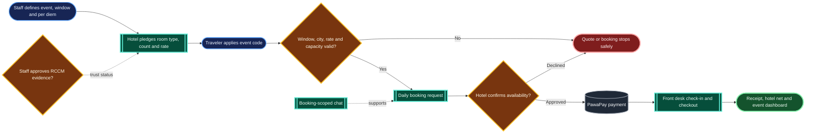
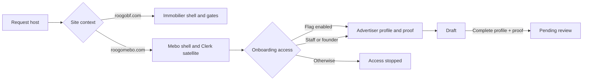

# System

Reference answers to "how does X work" questions worth keeping. Organized by topic,
not dated. For the reasoning behind these, see [`DECISIONS.md`](./DECISIONS.md); for
what shipped and when, see [`CHANGELOG.md`](./CHANGELOG.md).

---

## How does the Roogo hotel program work?

**Bottom line:** Roogo connects hotel supply to individual travelers and coordinated
events without becoming the hotel's internal management system. The mobile app owns
the traveler, hotel-admin, and reception workflows; this backend owns authorization,
business rules, durable booking/event state, staff review, analytics, and payouts.

A hotel admin creates or joins the hotel through a Supabase membership, publishes a
hotel listing, defines room types and counts, invites reception staff, and sets payout
defaults. Reception staff can find a paid reservation by booking code or guest phone
and move it through check-in and checkout, but admin-only actions such as room setup,
analytics, payouts, RCCM submission, event pledges, and group management remain
role-gated.

Travelers select a room type and dates, then use the existing daily request-to-confirm
flow. The hotel approves only after checking availability; the traveler pays through
PawaPay; the confirmed reservation supplies a shareable receipt and front-desk code.
The operations view summarizes 7-, 30-, or 90-day bookings, revenue, Roogo's 7% fee,
hotel net, room nights, occupancy, and payout settings. Booking chat stays scoped to
that reservation so operational messages do not become a general hotel inbox.

For coordinated travel, staff creates an event with a city, stay window, per-diem
ceiling, and code. Eligible hotels pledge a room type, a count, and optionally a lower
negotiated rate. Applying the code makes the server recheck the event window, city,
rate ceiling, and remaining per-night pledged capacity before quoting and again when
the booking is created. This prevents stale or concurrent requests from overselling
the block. Staff can then read pledged, confirmed, remaining, gross, and hotel-net
totals. Hotel groups are a separate create/join-by-code membership surface for hotels
that want a shared roster; they do not change booking ownership or payment flows.

The diagram answers who hands off each stage of an event booking. It intentionally
omits API route names and internal query details.

Hotel business verification is intentionally separate from personal KYC. An admin
submits legal identity, RCCM number, optional tax number, and a private document;
staff records one approve/reject decision. Duplicate pending submissions and stale or
concurrent staff decisions are rejected, so the hotel trust state cannot silently
move backward.

See the [hotel product-boundary decision](./DECISIONS.md#hotels-use-roogo-as-a-booking-and-payment-rail-not-as-a-pms--2026-08-30)
and the hotel terms in [DOMAIN.md](./DOMAIN.md#hotel-booking-and-coordinated-travel).

## How does the no-upfront monthly listing option earn revenue?

**Bottom line:** a monthly rental can be submitted for 0 FCFA today. If Roogo
brings the renter and collects the first rent, Roogo withholds one snapshotted
success fee equal to 50% of the monthly rent shown when the listing was created.
Ongoing rent collection starts enabled when a monthly agreement becomes active
and applies its 7% fee only to rents actually collected through Roogo. The owner
can opt out from the active agreement for future unpaid installments.

Web and mobile both default monthly rentals to `free_success_fee`, show the exact
FCFA success-fee amount, and require explicit acceptance for every property,
including furnished rentals. The API independently enforces the acceptance,
rejects paid add-ons on the free path, stores one pending row in
`property_listing_fees`, and snapshots the rate, base rent, final fee, and any
referral discount together with the accepted terms version and server timestamp.
The Premium tier determines listing entitlements but creates no payment at
submission. If the deferred-fee row cannot be created, the API removes the new
property instead of leaving a published promise with no charge record.

When the first paid rent schedule is credited, `creditOwnerEarningForSchedule()`
uses the pending fee instead of the ordinary collection calculation, records the
owner's net earning, and marks that fee `collected`. A unique property/fee
constraint and the unique schedule earning prevent a callback, poll, or retry
from charging it twice. A repair guard also recognizes an existing earning if a
previous run inserted it but failed before marking the fee collected, then
finishes that state transition without charging a later schedule. Later rent
schedules use the ordinary 7% collection calculation only when payment runs
through Roogo. `rent_collection_enabled` defaults to true for new monthly
agreements and false for daily or imported offline agreements. The owner can
disable it from an active monthly bail; schedule APIs then hide in-app payment
for future unpaid rents and the payment initiation API enforces the same rule.
When the acquisition success fee is still pending, only the earliest unpaid rent
remains payable through Roogo. Re-enabling collection restores in-app payment for
all unpaid schedules. Already-paid rents are never rewritten.

Paid publication packages remain a separate alternative: payment is collected
before submission and no deferred success-fee row is created.

An agreement created from a Roogo application, or from the renter's completed
Roogo property-lock payment, preserves the pending success fee. A direct
owner-created agreement with no Roogo application and an imported offline lease
both waive it automatically in the same database transaction, because those
paths are evidence that Roogo did not source the renter.

See the [economics decision](./DECISIONS.md#monthly-listing-economics-separate-acquisition-from-default-on-rent-collection--2026-09-01).

## How does Mebo share Roogo Web without becoming the immobilier site?

**Bottom line:** the request host selects a product context before the shared
application shell renders. Mebo reuses Roogo identity, data, deployment, and API
infrastructure, while its host receives Mebo routes, metadata, navigation, and
authentication configuration instead of the immobilier experience.

`lib/site-context.ts` normalizes forwarded hosts and classifies each request as
`immobilier` or `mebo`. On `roogomebo.com`, middleware rewrites Mebo public paths
to their internal `/mebo` implementations, and the root layout configures Clerk
as a production satellite. `NavHandler` selects the Mebo header, while the
immobilier JSON-LD, navbar, acquisition-source gate, and profile-name gate stay
out of the Mebo shell. Direct `/mebo` routes remain available for local and
deployment-preview testing.

Advertiser onboarding reuses the authenticated Supabase user but stores a
separate advertiser profile and business proof. Draft profiles may be saved and
resubmitted after changes or rejection; pending, approved, and suspended states
block unsafe edits. Submission requires all business fields plus a non-rejected
proof. Proof can be an allowed external URL or a validated PDF/image uploaded
through a signed slot into the private `advertiser-proofs` bucket. The public
rollout is controlled by `ADVERTISING_ONBOARDING_ENABLED`; staff and founders
retain access for controlled testing.

The diagram intentionally stops at pending review: it describes the shipped
host and advertiser-submission foundation, not a future review console or ad
delivery lifecycle.

See the [Mebo site-context decision](./DECISIONS.md#mebo-is-a-host-aware-roogo-surface-with-gated-advertiser-onboarding--2026-08-29).

## How do listing intent and admin filters compose?

**Bottom line:** every filter represents one independent property dimension,
and a listing must match all active dimensions. Keyword and location filter
descriptive data; property type filters physical shape; category separates
residential from commercial inventory; listing type separates rentals from
sales.

The admin properties API returns `listingType`, `propertyType`, and `category`.
Commercial property types map to `Business`; other supported types map to
`Residential`. The page never derives sale/rental intent from formatted prices,
and selecting `Locations` or `À vendre` compares the underlying `listingType`
directly. Missing legacy listing types retain the rental fallback used elsewhere
in the admin surface.

Expanded property surfaces use the same intent before considering rental period:

| Listing state   | Price title and unit             | Conditions and actions                                                                  |
| --------------- | -------------------------------- | --------------------------------------------------------------------------------------- |
| Sale (`vendre`) | `Prix de vente`, amount in FCFA  | No monthly/nightly suffix, caution, advance rent, rental application, or rental payment |
| Daily rental    | `Tarif par nuit`, FCFA per night | Daily-stay conditions                                                                   |
| Monthly rental  | `Prix du loyer`, FCFA per month  | Caution, advance rent, and eligible rental actions                                      |

This ordering matters for legacy data. A sale row may still contain `period =
month`, caution, or advance-rent defaults, but those fields never override
`listing_type = vendre` in the UI.

The filter card's expand/collapse animation hides overflow only while its height
is changing. Once expanded, overflow becomes visible so absolutely positioned
dropdowns can escape the animated wrapper. This is why increasing a menu's
`z-index` is not the fix for a clipped menu.

See the [listing-intent decision](./DECISIONS.md#listing-intent-stays-separate-and-controls-salerental-behavior--2026-08-29).

## How does motion work across Roogo Web?

**Bottom line:** motion is a shared orientation and feedback layer, not a
collection of page effects. Every route inherits the same timing curve and
reduced-motion behavior, while reusable navigation, onboarding, marketing, and
group-reveal components use the same compact vocabulary.

The root `AppMotionProvider` configures Framer Motion once for the entire web
application. A route change receives a short opacity transition that does not
transform the page container, so fixed dialogs and full-screen onboarding remain
anchored to the viewport. Staff pages add a brief terracotta route signal under
the stable navigation bar. Active navigation pills move with a heavily damped
spring, menus use opacity plus a few pixels of vertical travel, and buttons use a
small press response rather than hover jumps.

CSS animation and transition durations collapse under
`prefers-reduced-motion: reduce`, and Framer Motion follows the same system
preference through `MotionConfig`. The initial server-rendered frame is never
hidden; route motion begins only after hydration and only on later navigation.
Loading spinners remain because they communicate active work, but decorative
bounces, spinning success marks, and repeated progress pulses do not.

Public discovery pages use 8–12 px entrances and at most a 2 px hover offset so
search context stays spatially stable. Property galleries reserve scale changes
for opening an image, dialogs originate at 98.5% scale, and onboarding compresses
its stagger into a sub-300 ms rhythm. Payment and booking success animation is a
single confirmation stroke; it does not loop. These local rules all consume the
shared values in `lib/motion.ts` when a reusable timing is needed.

The root layout wraps every App Router branch—currently 47 page files—so legal,
auth, blog, tutorial, account, Mebo, and staff routes also inherit route feedback
and reduced-motion behavior even when they intentionally have no local animation.
The full-system audit also treats Tailwind transform utilities, modal variants,
validation shakes, image hovers, and loading indicators as part of the motion
surface; page-level Framer imports alone are not considered sufficient coverage.

`npm run motion:audit` enforces that contract across `app/` and `components/`.
It verifies the root provider and both reduced-motion layers, inventories every
`page.tsx`, and rejects oversized transforms, long one-shot entrances, overshooting
easing, decorative bounce/ping loops, and unguarded infinite motion. It runs as
`prebuild`, so a deployment build cannot silently bypass the motion baseline.

See the [motion-system decision](./DECISIONS.md#motion-explains-state-changes-instead-of-decorating-the-interface--2026-08-29).

## How does staff add ownership evidence to a review?

**Bottom line:** staff can append files to a pending ownership submission or
bootstrap one for an owner-linked sale that never completed the mobile document
step, so seller-provided and team-provided evidence reaches one approval or
rejection decision.

For an owner-linked sale whose ownership status is `unsubmitted` or `rejected`,
staff and founders can use **Ajouter un dossier** on the admin review page. The
server creates (or reuses) the property's pending submission under the real
seller, never under the staff account, and changes only the private ownership
review status. The listing gallery is not involved.

The admin review page accepts up to ten files at a time and twenty files across
the submission. PDF files are uploaded unchanged; browser-supported images and
iPhone HEIC/HEIF photos pass through the shared client image normalizer before
becoming JPEG. Each stored file is capped at 10 MB.

The browser asks a staff-only API for signed upload slots and then sends bytes
directly to the private `ownership-documents` bucket. A second staff-only call
attaches the resulting storage paths and metadata to the JSON document array.
Team-uploaded entries record `source = staff` and the uploader's Supabase user
id, including when the team bootstrapped the submission on the seller's behalf.
Both calls confirm that the submission is still pending, and attachment paths
must live under the selected seller, property, and current staff member's
namespace. Admin previews use short-lived signed read URLs; PDFs render as an
openable document card instead of being passed to the image renderer.

The approve/reject route remains the only operation that changes the review
status and the property's ownership-verification gate. Staff cannot append
evidence through this flow after a decision has been recorded.

See the
[staff evidence decision](./DECISIONS.md#staff-added-ownership-evidence-stays-on-the-pending-seller-submission--2026-08-19).

## How do we recover a hard-deleted property listing?

**Bottom line:** recover one listing without rewinding production. If no backup
from before deletion still exists, recreate the verified facts as an
`en_attente` property under the real owner, leave it private, and have staff
restore the photos and missing terms before publication.

Deletion is intentionally comprehensive: the property row is removed, linked
rows cascade, and `property_storage_cleanup_queue` purges the public
`listing/{propertyId}` folder. A successful cleanup row is therefore evidence
that the original image objects no longer exist, even if other folders remain
in the same bucket. Supabase database backups also exclude Storage object bytes.

Before reconstructing anything, staff should verify the owner account, search
the live database for a duplicate, inspect cleanup history, and separate any
surviving photos belonging to another listing. Recovered descriptions or search
indexes can help rebuild facts, but uncertain contractual fields must remain
unset until staff confirms them. The replacement receives a new property id and
starts private so it cannot be mistaken for a complete live listing.

For the 2026-08-11 Rimkieta recovery, the deleted row fell outside Supabase's
seven-day scheduled-backup window and Point-in-Time Recovery had not been
enabled. The safe path was therefore to recreate the monthly rental under the
verified owner, wait for Ablassé to upload its photos, and then use the existing
offline-lease importer to connect the renter.

See the
[targeted recovery decision](./DECISIONS.md#hard-deleted-listings-are-recreated-selectively-never-recovered-by-rolling-production-backward--2026-08-11).

## How does an existing offline lease enter Roogo?

**Bottom line:** staff imports a signed, property-specific relationship. Roogo
starts managing future rent from the first upcoming schedule, while past cash
stays visibly and financially outside the platform.

1. The property must be an available `en_ligne` monthly rental with a real owner
   or agent and no draft or active monthly agreement.
2. Staff or a founder opens **Importer un bail existant** from the property,
   owner, or renter admin view and selects the registered renter.
3. Staff enters the actual contractual rent, lease dates, caution, rent months
   already covered, offline payment details, exact commission received, and a
   required signed lease PDF or image.
4. `import_existing_monthly_lease` locks the property transactionally, creates
   one active `rental_agreement`, writes the immutable
   `rental_agreement_imports` audit row, marks covered schedules
   `payment_source = offline_import`, and leaves future schedules `upcoming` for
   the normal online flow.
5. Both users are notified and can see the imported agreement. The owner wallet
   remains unchanged because Roogo did not process the earlier money.

The operation uses an advisory transaction lock, so simultaneous submissions
cannot create two active agreements. Signed files live in the private
`rental-agreement-imports` bucket and download URLs are restricted to staff and
the agreement's two parties. The relationship is attached to this property, not
to a permanent global owner-renter pairing.

See the
[offline import decision](./DECISIONS.md#offline-leases-become-audited-roogo-relationships-not-retroactive-platform-payments--2026-08-07).

## How does a direct sale intake become an owner-linked listing?

**Bottom line:** a direct intake lets staff prepare a private, pending sale
before the owner has a Roogo account, but it does not make staff the owner and
does not weaken any publication gate.

1. Staff creates a `vendre` listing with the owner's first name, last name,
   normalized phone number, and WhatsApp availability. Those provisional
   details live privately in `sale_intakes`; `properties.agent_id` remains
   empty and no seller conversation is created.
2. The future owner creates a normal owner or agent account. Staff searches by
   name, email, phone, or WhatsApp and explicitly confirms the match. Matching
   data never links an account automatically.
3. The owner-link operation locks the intake, sets `properties.agent_id`,
   records who performed the link, and creates exactly one seller conversation
   in a single database transaction. The v1 interface does not offer
   reassignment.
4. Only after linking can the normal sale workflow continue: ownership
   documents, review, mandate delivery, the owner's own signature, and
   publication.

An unlinked sale returns the stable `sale_owner_link_required` publication
block before document and mandate checks. Public sale data never includes the
seller's account identifiers or profile fields; buyers see Roogo as the sole
interlocutor. Rentals retain their existing owner presentation.

See the
[direct intake decision](./DECISIONS.md#direct-sale-intake-is-provisional-contact-data-not-provisional-ownership--2026-08-06).

## How is the mobile app authorized to hit our API and Supabase?

**Bottom line:** the Expo app authenticates with a Clerk **Bearer JWT** (not the web
session cookie), so any route the mobile app calls has TWO independent gates it must
clear, and Supabase access rides on a **single app-wide token getter**.

1. **Middleware `isPublicRoute` (roogo-web/middleware.ts).** Clerk middleware runs on
   every request and, for non-public routes, expects a session cookie. Mobile has no
   cookie, so **every mobile-callable route must be listed in `isPublicRoute`** or the
   request is rejected before it reaches the handler. "Public" here only means "skip the
   cookie gate" — the handler still authorizes.
   - This is exactly why the founder couldn't answer support from the phone: the
     `/api/support/admin/*` routes existed and used `resolveClerkId` + CORS, but they
     weren't in `isPublicRoute`, so mobile Bearer calls never got through. Adding
     `/api/support/admin/(.*)` fixed it. **Lesson: a new mobile route isn't done until
     it's in `isPublicRoute`.**
2. **In-handler authorization.** Each such route verifies the JWT (`resolveClerkId`),
   resolves the Supabase user (`getOrSyncUserByClerkId`), and re-checks role
   (`isStaffLikeUserType`) — so exposing it to the cookie-less path never relaxes who can
   actually call it.
3. **Supabase client auth (mobile).** `lib/supabaseAuth.ts` holds ONE module-level token
   getter that supabase-js calls for RLS-gated reads + Realtime auth. It is registered
   **once at app root** (`app/_layout.tsx`), not per screen. Registering it per-hook was a
   footgun: unmounting one chat screen ran `registerSupabaseTokenGetter(null)` and
   de-authenticated any other still-mounted chat screen (silently killing its Realtime).

**Consequence:** two rules for any new mobile feature — (a) list its API routes in
`isPublicRoute` and gate them in-handler; (b) never touch the global Supabase token getter
from a screen/hook. See [decision](./DECISIONS.md#support-console-goes-mobile--read-receipts--2026-07-06).

## How do chat read receipts (✓✓ "Lu") work?

**Bottom line:** a message carries a nullable `read_at`. When the _recipient_ opens a
thread, the server stamps `read_at = now()` on the other party's un-read messages; the
_sender's_ client sees that change live over Realtime and flips the bubble from
✓ Envoyé to ✓✓ Lu.

- **Write:** `markConversationRead(convTable, msgTable, id, role)` (shared by support +
  sale via `lib/chat-read.ts`) zeroes the reader's `unread_for_*` counter and stamps
  `read_at` on messages where `sender_type != role`. Call sites gate it on
  `unread_for_<role> > 0` so an idle open/poll doesn't issue a no-op write + Realtime
  broadcast.
- **Deliver:** the chat hooks subscribe to `postgres_changes` with `event: "*"` (INSERT
  for new messages, UPDATE for the `read_at` flip) filtered by `conversation_id`, via the
  shared `useRealtimeMessages` hook. DELETE payloads carry no `new` row, so a `row?.id`
  guard skips them.
- **Render:** the shared `components/chat/ReadReceipt.tsx` shows the indicator only on the
  sender's OWN bubbles.

**Consequence / gotcha:** the live flip depends on Supabase delivering filtered UPDATE
events. If receipts only update after a manual refocus, the message tables likely need
`REPLICA IDENTITY FULL`. Cross-ref [decision](./DECISIONS.md#support-console-goes-mobile--read-receipts--2026-07-06).

## How do Visites 3D payment completions stay exactly-once?

**Bottom line:** three code paths can observe a deposit turn COMPLETED — the
PawaPay webhook, the client's 3-second status poll, and (rarely) the initiate
call itself when PawaPay completes synchronously. All three now route through one
function, `finalizeVisit3dCompletion()` in `lib/visit3d-callback.ts`, whose
conditional update (`.neq("payment_status", "completed")` + act only when a row
came back) makes the **database** the arbiter: exactly one caller wins the
transition and fires the side-effects (customer SMS, team SMS, PostHog
`visit3d_payment_completed`); the others no-op.

Why it matters: the previous read-then-check guard (`row.payment_status !==
"completed"` on a pre-fetched snapshot) was fine for sequential replays but
double-fired under the routine webhook-vs-poll race — duplicate billable SMS and
double-counted analytics. The webhook handler additionally carries a
terminal-state guard so PawaPay's at-least-once, possibly out-of-order delivery
can never regress a settled booking (only completed → refunded is allowed), and
DB lookup failures return 500 (so PawaPay retries) instead of being acknowledged
as "not found".

Related gotcha discovered in the same review: `booking_slots_view` is
`security_invoker` over an RLS deny-all table, so the **anon** Supabase key sees
zero rows through it — any consumer of that view must use the service-role
client (the view exposes only date+slot, no PII). This also means availability
was silently broken on the old Kazedra site.

## How do app updates reach users? (OTA vs store builds, and runtimeVersion)

**Bottom line:** the app updates through two pipes. OTA (expo-updates) pushes
new JavaScript silently on next launch: instant, no review, our default for
fixes. Store builds (EAS) ship the native binary: slow, reviewed, and the user
must act. `runtimeVersion` is the compatibility contract between them: an OTA
bundle is only delivered to binaries carrying the SAME runtime label.

Why it matters: adding native code (like v1.17.0's audio recorder and document
picker) means old binaries physically lack functions the new JS calls. Bumping
`runtimeVersion` protects them from receiving JS that would crash, but the
price is that everyone on the old binary is silently cut off from all future
OTAs until they install the store update, and nothing from Apple or Google
reliably tells them to. That gap is closed by the in-app update banner, fed by
`/api/app-version` (bumped only when a release is live in stores).

Rules of thumb: JS-only change, keep the runtime and ship OTA. Native change,
bump `version` + `runtimeVersion` together per
`roogo/docs/PRODUCTION_BUILD_CHECKLIST.md`, build both platforms, then bump
the endpoint after approval. Never bump the runtime for an OTA-only release.
(Decision: [update delivery policy](./DECISIONS.md#update-delivery-policy-ota-for-js-native-builds-when-needed--2026-07-09).)

## Why does migration 045 exist if the Visites 3D `bookings` table already lives in our database?

**Bottom line:** the kazedra site and roogo-web have always pointed at the **same
Supabase project**, so when the 3D-visits service migrated to Roogo (2026-07-06) the
`bookings` table, its indexes, the `booking_slots_view` and every past booking were
already "ours" — no data moved. Migration `045_visites_3d_bookings.sql` still needs
to be run once, for two reasons:

1. **One real change:** `drop column with_roogo` — the old dual-pricing flag
   (10 000 / 7 500 FCFA with the 25% Roogo discount) is retired in favor of the
   single 15 000 FCFA/pièce rate. The code no longer reads or writes that column;
   until 045 runs, it just sits there as dead weight (harmless, because it has a
   default).
2. **Baseline/bookkeeping:** everything else in 045 is written idempotently
   (`create table if not exists`, `create index if not exists`, `create or replace
view`) and is a **no-op against the live DB**. Its purpose is that roogo-web's
   migration folder now fully describes a table it owns — a fresh environment (or a
   future migration audit) can rebuild the schema from this repo alone, without
   digging up the deleted kazedra migrations.

So: not urgent, nothing breaks before it runs, but run it once so the schema and the
code agree. (Decision context: [Visites 3D move under the Roogo brand](./DECISIONS.md#visites-3d-move-under-the-roogo-brand--2026-07-06).)

## What are the AT\_\* / TEAM_PHONE env vars for (Visites 3D)?

**Bottom line:** they power the confirmation SMS sent after a 3D-visit booking is
paid — Africa's Talking is the SMS provider (chosen for Onatel/Orange/Telecel
coverage in Burkina).

- `AT_USERNAME` / `AT_API_KEY` — Africa's Talking credentials. `sandbox` as the
  username = test mode, no real SMS, no cost; the live app username sends real,
  billed SMS (~0.05 USD each, 2 per booking).
- `AT_SENDER_ID` — optional alphanumeric name shown as the SMS sender (e.g.
  "ROOGO"); must be approved by Africa's Talking, otherwise a shared shortcode is
  used. Leave empty in sandbox.
- `TEAM_PHONE` — the `+226XXXXXXXX` number that receives the internal "Nouvelle
  reservation 3D: …" alert so the team knows to schedule the shoot.

If these are missing in production, **bookings and payments still succeed** — the
SMS helper (`lib/africastalking.ts`) catches its own errors and just logs them; only
the notifications are skipped. That's why adding them to Vercel is an ops step, not
a blocker. Full flow reference: [visites-3d.md](./visites-3d.md).

## How does Roogo Sell (the broker model) work?

**Bottom line:** Roogo is the sole intermediary between sellers and buyers — they
never talk to each other. Since economics v2 (2026-07-09, migration 050), Roogo
earns a **disclosed commission**: a base percentage (default 10%) of the seller's
desired price, plus a share (default 50%) of any surplus when the sale closes above
that price. The old buy-low/sell-high spread model is retired.

**Economics (v2):** seller nets `D × (1 − base%) + (P − D) × (1 − split)` where `D`
is their desired price and `P` the final sale price. Example at 10%/50%: desired 3M,
sold 10M → seller walks away with 6.2M, Roogo earns 3.8M. The percentages are
platform settings on `listing_config` (founder-editable in `/admin/parametres`,
read live by web and mobile) and are **snapshotted onto each mandate at send time**,
so changing a setting never rewrites an agreed mandate. `sale_notary_price_basis`
records which amount the notary act uses (`desired` for now; switchable). Notary
fees are paid by Roogo. See
[the decision](./DECISIONS.md#roogo-sell-economics-v2-base-commission--5050-surplus-split--2026-07-09).

**Seller flow:**

1. Owner submits a `vendre` listing with the **amount they want to receive**
   (their desired price), plus ownership proof — primarily the **PUH** (_Permis
   Urbain d'Habiter_). The commission model is disclosed before they submit.
2. A seller↔Roogo chat (one thread per property) opens automatically. Roogo reviews
   the ownership docs.
3. Roogo sends a **mandate** (desired price + commission percentages + an
   exclusivity period). The owner **signs it in-app** (tap-to-confirm + typed name).
   Signing publishes the listing at the desired price.
4. Only then is the listing publishable and photographed by Roogo. Staff may then
   adjust the public price (`properties.price`) freely to experiment; the seller is
   deliberately NOT shown or notified of Roogo's listing price.

**Buyer flow:**

1. Buyer browses listed properties and opens a buyer↔Roogo chat (not the owner).
2. Roogo schedules **visits** (Roogo-run; the owner need not attend).
3. When there's a deal, Roogo schedules a **notary meeting at its office**. Background
   checks, signing, and payment happen offline there.
4. Visits and notary meetings appear as **cards in the thread + push notifications**,
   with a Google Maps link to the office.

## What gates a sale from going live — and how is that different from identity verification?

**Bottom line:** There are two independent things called "verification," and only one
of them gates publishing.

- **Identity (KYC) verification** — the owner's national ID. As of 2026-07-06 this is
  **optional** and never blocks posting; it only earns the trust badge. Enforced
  nowhere as a gate. (See the [decision](./DECISIONS.md#identity-kyc-becomes-optional--2026-07-06).)
- **Ownership verification** — the property documents (PUH etc.), reviewed per
  listing. For a **sale**, the listing cannot go `en_ligne` until
  `ownership_verification_status = 'approved'`.
- **Signed mandate** — a sale also cannot go `en_ligne` until a `property_mandates`
  row for it is `status = 'signed'`.

Both sale gates live in `app/api/properties/[id]/status/route.ts` and apply only to
`listing_type = 'vendre'`. Rentals have neither; they're gated only by staff
moderation (and any payment/tier requirements).

The practical consequence: an owner can post a property without proving who they are,
but Roogo will not publish a sale — and cannot take its spread — until it has verified
the property's ownership and the owner has signed the mandate.
